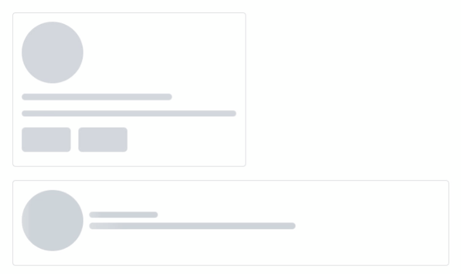
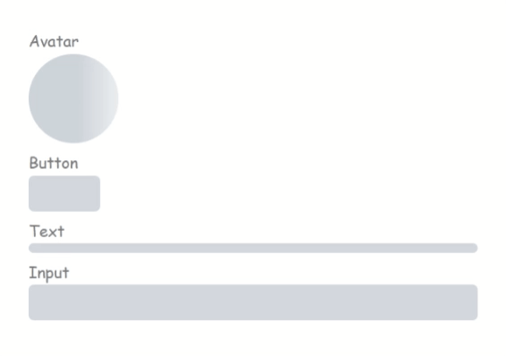

# easy-skeleton-loader-vue

> Loader showing skeleton view while data is being loaded to improve UX.

- easy to used

```ts
  <SkeletonShape type="text" animation="fade-in" />
```

- build your own skeleton

```ts
  <SkeletonCard animation="wave" />
  <SkeletonUser animation="fade-in" />
```



## Installation

Install easy-skeleton-loader-vue with : 
- npm

```
  npm install easy-skeleton-loader-vue --save
```
- yarn

```
 yarn add easy-skeleton-loader-vue
```


## Usage/Examples

- import styles.css in your App.vue

```ts
import 'easy-skeleton-loader-vue/styles.css';
```

#### now you can use the skeleton 

- Using 'easy-skeleton-loader-vue' in your .vue file

```ts
<script setup lang="ts">
import 'easy-skeleton-loader-vue/styles.css'
import { SkeletonShape } from 'easy-skeleton-loader-vue'
</script>

<template>
  <h3>Avatar</h3>
  <SkeletonShape type="avatar" animation="wave" />
  <h3>Button</h3>
  <SkeletonShape type="button" animation="fade-in" />
  <h3>Text</h3>
  <SkeletonShape type="text" animation="fade-in" />
  <h3>Input</h3>
  <SkeletonShape type="input" animation="fade-in" />
</template>
```

This would give u a diff. shapes :



## Contributing

Contributions are always welcome!

#### you can share your custom shape, you can refactor code, you can fix bugs by

### Creating A Pull Request

1. Fork the Project
2. Create your Feature Branch (`git checkout -b feature/FeatureName`)
3. Commit your Changes (`git commit -m 'Add some feature description'`)
4. Push to the Branch (`git push origin feature/FeatureName`)
5. Open a Pull Request
## API

|Prop|Type|Default|Options|Description|
|---|---|---|---|---|
|width|number, string|'100%'||The is the width of the loader, and can be either a number or string. This property would be overridden if the `size` props is set|
|height|number, string|16px||The is the height of the loader, and can be either a number or string. This property would be overridden if the `size` props is set|
|type|string|'text'|text, button, avatar, input|This is the type of the loader. It could be circle or rectangle shaped|
|animation|string|'fade-in'|fade-in, wave|The animation to be applied to the loader|
|radius|number|12||This is used to determine the border radius of the loader|
|count|number|1||This is used to determine the number of the loader|


## How to Give a Star

If you find this useful, please consider giving it a star on GitHub to show your support. 

1. Go to the repo [easy-skeleton-loader-vue](https://github.com/alihdev/easy-skeleton-loader-vue).
2. Click on the "Star" button in the top-right corner of the page.

Your support is greatly appreciated! :star:

## Authors

- [**Ali Hassan**](https://github.com/alihdev) - *Software developer*
